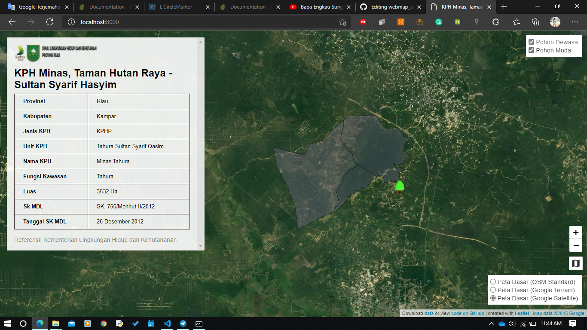

# leaflet-point-map-sidebar: Web Map Adopsi Pohon Riau -v1.1
Update 31 Oktober 2021:
1. penyesuaian data CSV berdasarkan format webmap
2. penambahan unit pada data serapan karbon dan harga adopsi
3. tambahan feature event listener

Beberapa hal yang belum lengkap:
1. Leaflet search button,
2. Icon pada legend,

Link Map: https://simarmata12soni.github.io/webmap_adopsipohon1_/

Template from by Ilya Ilyankou and Jack Dougherty. Learn how to create your own copy and see related Leaflet map templates in our book, *Hands-On Data Visualization*: https://handsondataviz.org/leaflet.html

